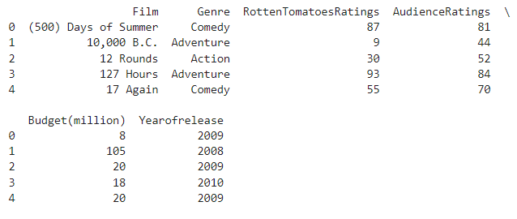
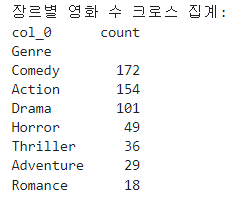
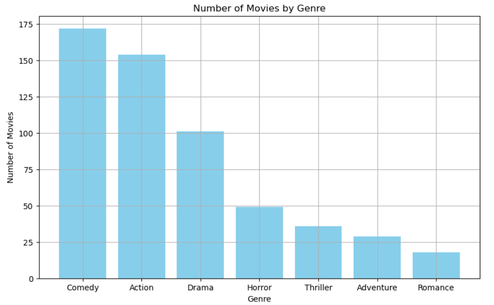
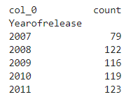
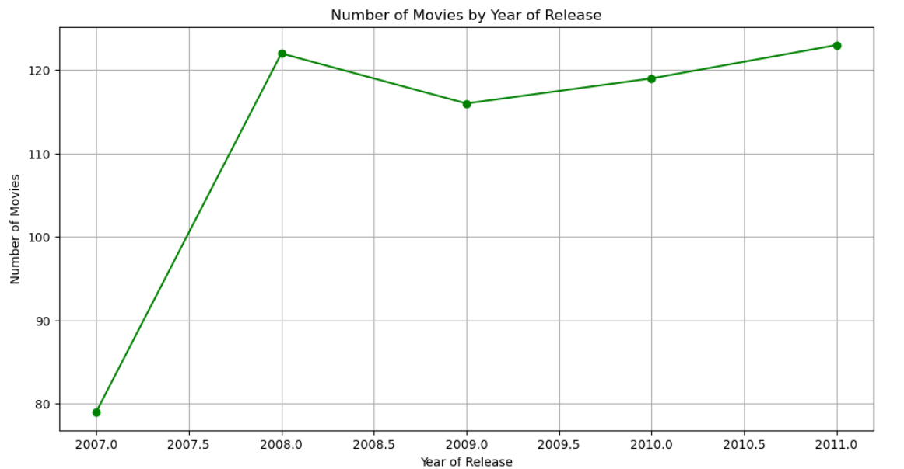
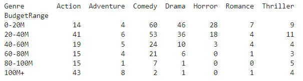
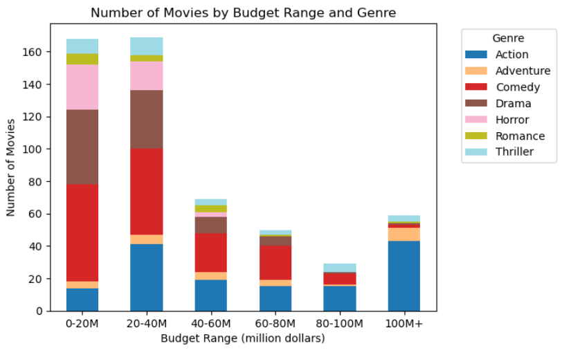

### 1️⃣ 프로젝트 목적

- 데이터엔지니어링에서는 분산 스토리지의 데이터를 통합한 후 BI툴로 시각화한다.
- 분산환경 구축과 빅데이터 처리, 시각화는 학습 초기단계에서 실습부담이 크다.
- 이에 최소화된 환경에서 스몰데이터로 애드 혹 분석을 위한 시각화를 실습해본다. (감 잡기)
- 환경: Jupyter Notebook, 스몰데이터: cvs파일, 시각화: Matplotlib


### 2️⃣ 사용기술

- 영화 스몰데이터이 담긴 csv파일을 Jupyter환경에서 애드 혹 분석하기 위해 필요한 기술목록입니다.
- `Jupyter Notebook`, `Pandas`, `Matplotlib`, `Seaborn`

- 위의 기술들을 사용하였으며, 사용 이유는 아래와 같습니다.


1. Jupyter Notebook
- 스프레드시트, BI도구 없이 노트북 안에서 크로스 집계 가능
- 웹브라우저지만 로컬호스트에서 작동
  - CSV, 엑셀 등 파일 업/다운로드 시간 소요 X
  - Notebook 자체도 Json으로 로컬 파일로 손쉽게 처리 가능 -> Git과도 호환, 관리 용이

2. Pandas
- 데이터 조작과 분석을 위한 강력한 Python 라이브러리

3. Matplotlib
- 시각화 라이브러리
- Jupyter Notebook에서 애드 혹 분석을 위해 주로 사용함

4. Seaborn
- Matplotlib을 기반으로 하는 고급 시각화 라이브러리
- 보다 세련되고 다양한 그래프를 쉽게 그릴 수 있도록 도와줌


### 3️⃣ 개발환경 세팅

- 아래는 패키지관리를 위해 콘다 가상환경을 설정

- 영화 샘플파일을 다운
- Jupyter를 실행하는 과정입니다.


1. 콘다 가상환경 설정

- 콘다 가상환경 생성

  - 패키지 라이브러리 관리를 위해 가상환경을 생성한다.

  - `$ conda create -n pandas-practice-env python`

  - `C:\Users\asus\anaconda3\envs\pandas-practice-env`에 가상환경 생성

  - `conda info --envs`로 가상환경 리스트 확인


- 콘다 가상환경 실행
  - `conda activate pandas-practice-env`


- 시각화를 위한 라이브러리 설치
  - `conda install pandas matplotlib seaborn`


- 패키지 목록 추출
  - `conda list --export > conda_requirements.txt`
  - 이후 git관리 시 다른 로컬 가상환경에서 현재 레파지토리와 같은 환경을 설정하기 위함


2. csv파일 준비
- 실습을 위한 샘플파일 다운로드
  - 출처: https://lcj8390.tistory.com/93

- movie-ratings.csv, 560레코드

|   Film   | Genre | AudienceRatings |    RottenTomatoesRatings    | Budget(million) | Yearofrelease |
| :------: | ----- | :-------------: | :-------------------------: | :-------------: | :-----------: |
| 영화제목 | 장르  |    관객평점     | RottenTomatoes웹사이트 평점 |    영화예산     |   개봉연도    |


- jupyter notebook 실행 디렉토리로 이동


3. jupyter notebook 시작

- jupyter notebook 실행

  - `jupyter notebook`

- python3 새로운 파일 생성

  - 생성하니 주피터 노트북의 버그로 인해 문제가 발생, 주피터 노트북을 최신 버전으로 업데이트

  - `pip install --upgrade jupyter`

  - `New`버튼으로 `ipynb`생성 후 `pandas-practice.ipynb`로 이름 변경


### 4️⃣ notebook환경에서 데이터 시각화 실습

- 본격적으로 Jupyter에서 데이터 시각화를 실습하는 과정입니다.

- 영화 스몰데이터가 담긴 csv파일을 가져오고
- 장르별 영화 수를 막대 그래프로 시각화
- 개봉 연도별 영화 수를 선 그래프로 시각화

- 예산 범위와 장르별 영화 수를 스택드 바 그래프 시각화하였습니다.


#### 0. csv 데이터 가져오기

pandas, matplotlib, seaborn 임포트
```python
import pandas as pd
import matplotlib.pyplot as plt
import seaborn as sns
```


현재 경로에 있는 movie-ratings.csv파일 불러오기

```python
file_path = 'movie-ratings.csv'
df = pd.read_csv(file_path)
```


데이터프레임 확인

```python
print(df.head())
```




#### 1. 장르별 영화 수

크로스 집계



```python
genre_counts = pd.crosstab(index=df['Genre'], columns='count')

# 내림차순 정렬
genre_counts = genre_counts.sort_values(by='count', ascending=False)

print(genre_counts)
```


막대 그래프 시각화



```python
plt.figure(figsize=(10, 6))
plt.bar(genre_counts.index, genre_counts['count'], color='skyblue')
plt.xlabel('Genre')
plt.ylabel('Number of Movies')
plt.title('Number of Movies by Genre')
plt.xticks(rotation=0)
plt.grid(True)
plt.show()
```


#### 2. 개봉 연도별 영화 수 

크로스 집계



```python
year_counts = pd.crosstab(index=df['Yearofrelease'], columns='count')
```


선 그래프 시각화



```python
plt.figure(figsize=(12, 6))

# marker='o', linestyle='-', 데이터 포인트 = ●, 라인 스타일 = 실선
plt.plot(year_counts.index, year_counts['count'], marker='o', linestyle='-', color='green')
plt.xlabel('Year of Release')
plt.ylabel('Number of Movies')
plt.title('Number of Movies by Year of Release')
plt.grid(True)
plt.show()
```


#### 3. 예산 범위와 장르별 영화 수

크로스 집계



```python
bins = [0, 20, 40, 60, 80, 100, 200]
labels = ['0-20M', '20-40M', '40-60M', '60-80M', '80-100M', '100M+']
df['BudgetRange'] = pd.cut(df['Budget(million)'], bins=bins, labels=labels)
budget_genre_counts = pd.crosstab(index=df['BudgetRange'], columns=df['Genre'])
print(budget_genre_counts)
```


스택드 바 그래프 시각화



```python
budget_genre_counts.plot(kind='bar', stacked=True, colormap='tab20')
plt.xlabel('Budget Range (million dollars)')
plt.ylabel('Number of Movies')
plt.title('Number of Movies by Budget Range and Genre')
plt.xticks(rotation=0)
plt.legend(title='Genre', bbox_to_anchor=(1.05, 1), loc='upper left')
```
